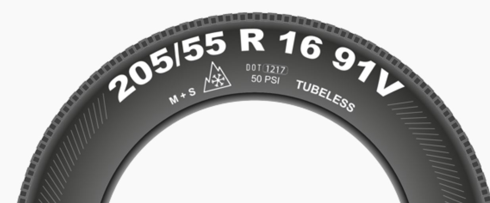

# Table of Contents

- [Chapter-1: Personal requirements / Human risk factor](#chapter-1)
- [Chapter-2: Legal Framework](#chapter-2)
- [Chapter-3: Road traffic system and its use](#chapter-3)
- [Chapter-4: Right of way](#chapter-4)
- [Chapter-5: Traffic regulations and behavior](#chapter-5)
- [Chapter-6: Traffic signs, traffic facilities and level crossings](#chapter-6)
- [Chapter-7: Other participants in road traffic](#chapter-7)
- [Chapter-8: Speed and Distance Thema](#chapter-8)
- [Chapter-9: Traffic behaviour during driving maneuvers, observing the traffic](#chapter-9)
- [Chapter-10: Stationary Traffic - Exam Critical Notes](#chapter-10)
- [Chapter-11: Behaviour in Special Situations - Exam Critical Notes](#chapter-11)
- [Chapter-12: Lifelong learning, consequences of violations](#chapter-12)
- [Chapter-13: Technical conditions, persons and goods authorization](#chapter-13)
- [Chapter-14: Driving Solo Vehicles and Trailers: Environmentally Friendly Driving Style](#chapter-14)

  

## Chapter-1

### Personliche Voraussetzungen / Risikofaktor Mensch (Personal requirements / Human risk factor)

1. As a rule, about 0.1 per thousand blood alcohol concentration is broken down in the body every hour.
2. LSD, which stands for lysergic acid diethylamide, is a powerful hallucinogenic (or psychedelic) drug

  

## Chapter-2

### Rechtliche Rahmenbedingungen (Legal Framework)

1. Registration Certificate Part-1 contains information about the technical modifications, about the load which you can carry (permissible load with which you can drive the car).
2. Registration Certificate Part-2 generally contains only the technical information related to the vehicle.
3. Car PTM + Trailer PTM ≤ 3,500 kg (3.5 ton)
PTM is Permissible Total Mass

  

## Chapter-3

### Straßenverkehrssystem und seine Nutzung (Road traffic system and its use)

1. Left hand lane only to be used for overtaking, otherwise just stay in the middle lane.
2. Right hand lane is for slow moving vehicles.
3. Right hand hard shoulder can be used for stopping and parking but not for overtaking outside the build up areas.
4. Hazard lights are to be switched on when there is a traffic jam, when there is some accident on the road, when there is a traffic jam or traffic accident inside a tunnel
5. On autobahns you can drive faster than the range of visibility (only exception on autobahn)

  

## Chapter-4

### Vorfahrt (Right of way)

1. The traffic sign “Give priority to oncoming traffic” shows with the red arrow that you must give priority to oncoming traffic.
2. Sign 276 No passing zone sign,  the overtaking of two-line vehicles is not allowed. One-line transport (motorcycles) can still be overtaken.
3. The traffic sign "pedestrian area" prohibits motor vehicles entering this area, even walking speed is prohibited
4. Electric scooters are becoming more common, they ride on the cycle path, so watch out for scooter riders as well along with cycles.
5. On priority roads outside of built-up areas, you may: 1. wait at the right side of the road; 2. park on a hard shoulder. On the other hand, parking on the road is prohibited. Parking vehicles constitute a hindrance and/or danger to flowing traffic, since vehicles are traveling much faster here than within the closed local area. Since a hard shoulder is not considered a lane, you may use it for parking. If there is a possibility to dodge on a hard shoulder, you should also use this for waiting shortly.
6. The Orange diversion arrow points out to you as a car driver that you are on a traffic jam-prone section of the motorway and points out an alternative route. But you are not obliged to follow this.

  

## Chapter-5

### Verkehrsregelungen Und Verhalten (Traffic regulations and behavior)

1. Face of the police officer towards us, then we need to stop.
2. The right side strip may be used in the following cases: 1. for holding and parking, 2. for slow moving vehicles such as mopeds or agricultural tractors and machinery.
3. Slow-moving vehicles such as tractors, mopeds must use the hard shoulder. Other vehicles that go faster than 45km/h need to remain on the road
4. Agricultural tractors - Very slow (often 25–40 km/h)
5. Mopeds - Very low speed (~25–45 km/h)
6. Small-engine motorcycles - even if engine is small, they can usually go much faster than mopeds. Often capable of: 60–100+ km/h
7. When crossing a priority road, you must keep in mind: 1. the width of the priority road, 2. the distance and speed of oncoming traffic, 3. the weather conditions.
8. According to the German Road Traffic Regulations (Straßenverkehrsordnung - StVO), motorways may only be used by vehicles with a maximum design speed of more than 60 km / h.
9. The braking distance of your vehicle depends on the tires, the brake system and the condition of the road.
10. 50 km/h is the legally prescribed maximum speed limit within cities (Build-up areas).
11. Human ability to estimate distance traveled per second is Reaction Distance.
12. The braking distance is the distance you travel from the start of braking until your vehicle stands.
13. When you are driving on a wide road on which oncoming traffic can pass by you, unobstructed. You must be able to stop within the distance you can see in case obstacles enter the carriageway.
14. As a rule of thumb, you should keep at least a distance of half of your speed in meters. In poor visibility or road conditions, the distance should be increased.
15. Outside built-up areas, the minimum distance to be maintained for pedestrians, cyclists and personal transporters is 2 metres.
16. In built-up areas, the minimum distance for pedestrians, cyclists and personal transporters is 1.5 metres.
17. In one-way streets, however, there is no general rule of no overtaking. You can overtake.
18. You may only overtake a vehicle in front of you if you are significantly (at least 20 km/h) faster. Also, when overtaking: Do not exceed the maximum speed limit.
19. Trams must in general be overtaken on the right. If vehicles are parked here, you have to drive behind the tram. If the rails are too far to the right, trams may also be overtaken on the left.
20. When overtaking you must always keep sufficient distance to the road users next to you. This must be particularly large with motorcycle and bicycle riders.
21. You may overtake the bus on the bus lane.
22. To allow faster vehicles to overtake you on a country road, you can dodge on a suitable side stripe, a lay by or in a rest stop. It is also possible to slow down or even stop at a suitable location.
23. If there is an obstacle on a road or if a multi-lane road narrows, then zip merging applies to all vehicles traveling in the same direction. Drive to the end of your lane. Do not change lanes earlier to prevent tailback. Wait here until a vehicle on the adjacent lane lets you enter. Only move over just before the road starts to narrow by following the zipper feed-in method
24. In a tunnel with oncoming traffic, you must behave as follows: Orient yourself on the right side of the road and avoid looking directly into the light of oncoming traffic. You must not drive over or turn on the road edge marking. If necessary, increase the safety distance, drive anticipatory and pay attention to restriction on overtaking.
25. If a lane ends, vehicles should only merge into the lane right before the beginning of the constriction.
26. You are not allowed to stop on the roadway in a roundabout
27. If you want to turn left, prepare the turn in the following order: 1. look, 2. indicate, 3. arrange.
28. In front of the traffic sign "Stop! Give way!", colloquially also called stop sign, you must always stop. Mostly there is a stop line. The wheels must be stationary for at least a short amount of time.
29. In a one-way street, you don't need to fear oncoming traffic. Indicate in time. Then merge left and stay on the left lane until you reach the turn for left turn.
30. When there is a traffic congention do not drive into crossroads, junctions, pedestrial crossing, level crossing. However you can enter into Bus Stops.
31. The red arrow in your direction indicates that priority is given to oncoming vehicles.
32. Stopping Prohibited -
- On level crossings
- At taxi ranks
- On narrow sections of the road and at blind spots
- On the roadway, if there is a sufficiently wide hard shoulder on the right
- Between lane dividers when direction arrows are marked on the roadway
- On pedestrian crossings and up to 5 m before pedestrian crossings.
- Stopping is allowed on manhole covers, but not parking.
33. Parking Prohibited -
- On priority roads outside built-up areas. However you should use Use side strips or parking bays outside build-up areas.
- At the edge of the roadway if this would prevent others from using designated parking areas
- Parking is not allowed on manhole covers
- Before sunken kerbstones
34. A "stop" is when a vehicle stops for less than 3 minutes for reasons unrelated to traffic without the driver getting out of the vehicle. If the driver stops for a longer time and/or leaves his vehicle, this is called parking.
35. You may only park in the direction of travel on the right-hand side of the road.
36. The only exception are one-way streets, as they are only used in one direction of travel, you can park on both sides in the direction of travel.
37. If there are rails on the right, you must also park on the left, but always observe parking restrictions.
38. If parking is forbidden on the right, It does NOT automatically mean you can park on the left.
39. In case of a breakdown in a tunnel, Switch on the hazard light on your car and switch off the engine due to the high risk of poisoning by exhaust gases in the tunnel.
40. If possible, switch on the side lights when it is dark
 at a level crossing when the barriers are closed. parking light is sufficient.
41. Maximum distance a load may project backwards beyond the rear reflectors without a projection marker being necessary is 1 meters.
42. If you carry cargo that protrudes more than 1 m from the end of the vehicle, it must be marked accordingly by a red light and a red reflector.
43. An orange warning sign indicates vehicles that are loaded with dangerous goods as so-called hazardous materials transportation.
44. At the front, the load may protrude only above a height of 2.5 m by a maximum of 50 cm.
45. Responsible for the roadworthy condition of a vehicle are both the owner of the vehicle as well as the driver.
46. You must not overtake the cyclist before and at a pedestrian crossing.
47. In no case may a vehicle be overtaken before and on pedestrian crossings.
48. When traffic is halting, you must not stop on a pedestrian crossing. Here, the same rule of intersections and T-junctions applies, which must also be kept clear.
49. In Germany emergency numbers for the police are 110 as well as 112 for the accident ambulance and the fire department.
50. You should exchange the most important information with the other party involved in the accident in order to be able to get in touch. You should also mutually record the course of the accident. Document the damage with photos. This enables the insurance company to better assess and evaluate the damage.

  

## Chapter-6

### Verkehrszeichen, Verkehrseinrichtungen und Bahnübergänge (Traffic signs, traffic facilities and level crossings)

1. The "Children" danger sign on the right makes it clear that increased attention and a special degree of caution are necessary at this point. In addition to children, adults can of course also suddenly step onto the roadway. 

  

## Chapter-7

### Andere Teilnehmer im Straßenverkehr (Other participants in road traffic)
1. If a public bus or school bus has its hazard lights on and is still moving, you must not overtake it.
2. You may pass the stationary bus at walking speed provided you are sure that passengers are not endangered.
3. When the hazard warning lights of a bus are switched on at a bus stop, all vehicles in both directions must pass the bus at walking speed.
4. If a bus has not switched on its hazard warning lights, you do not have to slow your vehicle down to walking speed. But be especially attentive in the situation!
5. You may carefully pass a stopping tram at walking speed - but only if this does not endanger or obstruct any passengers.
6. On wet roads, the adhesion between the tyre and the road is poorer due to the water film. As a result, the braking distance is considerably longer.
7. If there is oil on the road, notify the fire brigade so that the oil can be bound.
8. While driving you can safely check whether the road is icy by carefully applying the brakes at very low speed.
9. If you are dazzled by a high beam or incorrectly adjusted headlights, do not look into the cone of light but to the right edge of the road.
10. On narrow roads, to avoid danger, as a vehicle driver you must always keep a sufficient safety distance of at least 1.50 metres when overtaking cyclists.
11. The use of the hazard warning lights is subject to strict rules. You may only switch on the hazard warning lights to secure your broken-down vehicle or to indicate a traffic jam or a school bus. A school bus with its hazard warning lights on may only be overtaken at walking speed.
12. E-bikes are just as quiet as classic bikes and are therefore often perceived late. However, they often achieve significantly higher speeds than bicycles without an engine.
13. 2 wide trailers can be attached to the farm tractor.
14. You must not switch on the fog lamp in the tunnel.
15. If there is a traffic jam in a tunnel, stop and turn off the engine. By keeping a safe distance of about five metres, you reduce the risk of poisoning, preserve a manoeuvring option and allow rescue vehicles to pass. Only leave your vehicle after an appropriate loudspeaker announcement.
16. If the deer is not yet on the road, you should under no circumstances perform emergency braking. This would unnecessarily endanger other road users and force them to unpredictable reactions. 
17. If a fire in your vehicle prevents you from leaving a tunnel: Park the vehicle unlocked with the engine switched off and the ignition key remaining in the lock. Alarm the tunnel monitoring center. Take the next escape route on foot.
18. You can see that the animal is about to run on the road. Horns may help stop it. In addition, you should initiate emergency braking to reduce a potential collision. Do not dodge! This rather leads to accidents with personal injury than a collision with an animal.
19. The body breaks down only about 0.1 permille alcohol per hour.
20. Driving under the influence of drugs can mean the loss of your driver's license.
21. If he is a drug addict, the person must live drug-free for a full year before he can get back his driving license. Proof of this is given by the Appraisal Body (Ger. Begutachterstelle für Fahreignung (BfF)) in form of a report.
22. Driving a vehicle under the influence of drugs such as hashish, cocaine or heroin may result in: withdrawal of the license, a fine and/or imprisonment. Imprisonment may amount to up to five years if other persons were endangered. In order to get your driving license back, you have to undergo a medical-psychological assessment (MPA).
23. During the probation period or before the age of 21, a limit of 0.0 permille applies to you before each journey and while driving a motor vehicle: an absolute alcohol ban.
24. During the probationary period you must not drink any alcohol if you want to drive a motor vehicle. In general, you should stick to 0.0 permille when participating in traffic.
25. Cannabis and its breakdown products are traceable in your urine for a period between ten days and three months after consumption. 

  

## Chapter-8

### Geschwindigkeit und Abstand (Speed and Distance Thema)

  

## Chapter-9

### Verkehrsverhalten bei Fahrmanövern, Verkehrsbeobachtung (Traffic behaviour during driving maneuvers, observing the traffic)

  

## Chapter-10

### RUHENDER VERKEHR (Stationary Traffic - Exam Critical Notes)

  

## Chapter-11

### VERHALTEN IN BESONDEREN SITUATIONEN (EXAM-CRITICAL NOTES)

  

## Chapter-12

### Lebenslanges Lernenm, Folgen von verstoessen (Lifelong learning, consequences of violations)

  

## Chapter-13

### Technische Bedingungen, Personen und Gueterbegoerderung (Technical conditions, persons and goods authorization)

1. After every 2 years, the owner has to go for the inspection (TUV Inspection), to check if every system in car is working properly and they will certify your car. It is called roadworthiness.
2. We go to dealer whenever we want to purchase a new car.
3. If your vehicle is no longer covered by Motor Liability Insurance then vehicle must be de-registered at the registration centre, to tell them that you are not using that car on road traffic.
4. There are selector levels in automatic cars. To change the selector level it does not required for the engine of the car to be set-off. Only service brakes are required when selecting a gear.
5. Engine oil boosts cooling, cleaning and wear protection.
6. Advance Driver Assistance System (ADAS), like Adoptive Cruise Control System, Independent Braking System, Lane Keeping Feature, Parking help, Camera View, Radar System, Lane Departure Warning System are all part of ADAS.
7. Anti-Lock Braking System (ASP), prevents skidding or locking, prevents the wheels locking. Braking System and Braking effect can be achieved quickly by applying pressure on the brakes. Never locks the wheels even when braking. Streeing capability is retained.
8. Anti Slip Regulation (ASR) device, avoid wheel slipping, even on wet roads / when setting off, locks the wheel when braking.
9. Acoustic – which is audible, Haptic – which can be felt like vibration, Optic – which is visible
10. Electronic Stability Programme (ESP), calculate in which direction the road is going. And give indication if not done correctly. If speed is more on bends. Gives indication how your car is depending on the road scenario.
11. Lane Keep Assist System is to keep you in the lane, it does not help you while turning or overtaking.
12. Permissible minimum tread depth of the main tread of all your vehicles tyres – 1.60mm

13. 1217 – means a tyre is manufactured in 12th calendar week of the year 2017.

15. Engine has nothing to take with the defective exhaust system.
16. Air Filter has nothing to take with defective exhaust system.
17. When load is beyond 1m towards the bvack side, do some markings

18. Orange warning plates on a vehicle is for transporting the dangerous goods.

19. Upto 2.5m height is a load not allowed to project over the front of the vehicle.
20. Lateral side load if greater than 40 cm, put white light on the front and red light on the back.
21. 1.50m is the Max height allowed above the roadway for a red light marking a load extending to the back.

23. Lashing straps – are the straps with with we try to secure the load and tie the load.
24. Registration Certificate Part-1, type of your license, upto which load you can drive, how many trailers, where you have registered your car etc.
25. Chocks are placed below tyres, so that they do not move, or to stop from rolling.
26. 

  

## Chapter-14

### Fahren Mit Solokraftfahrzeugen Und Anhaengern, Umweltschonende Fahrweise (Driving Solo Vehicles and Trailers: Environmentally Friendly Driving Style)

1. Total mass of 2.80 ton of motor vehicles can be parked on specially designated footpaths.
2. Registration Certificate Part – 1, contains type of license, how much load being allowed to tow, operating manual of the car.
3. Stopping Distance = Braking Distance + Reaction Distance
4. Jack Wheel is not required during driving.
5. At STOP sign we only stop for a moment but do not switch off the engine.
6. While filling the fuel, brim is actually above the maximum allowed levels.
7. Environmental areas –

8. Catalytic converter is linked with your engine.
9. Washing engine does not help in energy saving.
10. 

  

