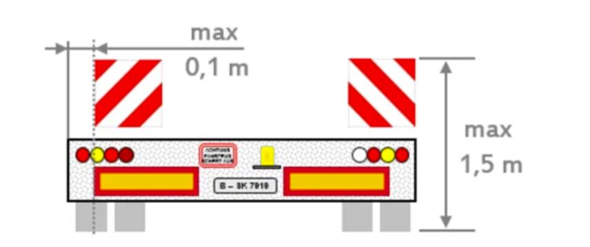

# Table of Contents

- [Chapter-1: Personal requirements / Human risk factor](#chapter-1)
- [Chapter-2: Legal Framework](#chapter-2)
- [Chapter-3: Road traffic system and its use](#chapter-3)
- [Chapter-4: Right of way](#chapter-4)
- [Chapter-5: Traffic regulations and behavior](#chapter-5)
- [Chapter-6: Traffic signs, traffic facilities and level crossings](#chapter-6)
- [Chapter-7: Other participants in road traffic](#chapter-7)
- [Chapter-8: Speed and Distance Thema](#chapter-8)
- [Chapter-9: Traffic behaviour during driving maneuvers, observing the traffic](#chapter-9)
- [Chapter-10: Stationary Traffic - Exam Critical Notes](#chapter-10)
- [Chapter-11: Behaviour in Special Situations - Exam Critical Notes](#chapter-11)
- [Chapter-12: Lifelong learning, consequences of violations](#chapter-12)
- [Chapter-13: Technical conditions, persons and goods authorization](#chapter-13)
- [Chapter-14: Driving Solo Vehicles and Trailers: Environmentally Friendly Driving Style](#chapter-14)

  

## Chapter-1

### Personliche Voraussetzungen / Risikofaktor Mensch (Personal requirements / Human risk factor)

1. As a rule, about 0.1 per thousand blood alcohol concentration is broken down in the body every hour.
2. LSD, which stands for lysergic acid diethylamide, is a powerful hallucinogenic (or psychedelic) drug

  

## Chapter-2

### Rechtliche Rahmenbedingungen (Legal Framework)

1. Registration Certificate Part-1 contains information about the technical modifications, about the load which you can carry (permissible load with which you can drive the car).
2. Registration Certificate Part-2 generally contains only the technical information related to the vehicle.
3. Car PTM + Trailer PTM ≤ 3,500 kg (3.5 ton)
PTM is Permissible Total Mass

  

## Chapter-3

### Straßenverkehrssystem und seine Nutzung (Road traffic system and its use)

1. Left hand lane only to be used for overtaking, otherwise just stay in the middle lane.
2. Right hand lane is for slow moving vehicles.
3. Right hand hard shoulder can be used for stopping and parking but not for overtaking outside the build up areas.
4. Hazard lights are to be switched on when there is a traffic jam, when there is some accident on the road, when there is a traffic jam or traffic accident inside a tunnel
5. On autobahns you can drive faster than the range of visibility (only exception on autobahn)

  

## Chapter-4

### Vorfahrt (Right of way)

1. 

  

## Chapter-5

### Verkehrsregelungen Und Verhalten (Traffic regulations and behavior)

1. Face of the police officer towards us, then we need to stop.

  

## Chapter-6

### Verkehrszeichen, Verkehrseinrichtungen und Bahnübergänge (Traffic signs, traffic facilities and level crossings)

1. F

  

## Chapter-7

### Andere Teilnehmer im Straßenverkehr (Other participants in road traffic)

  

## Chapter-8

### Geschwindigkeit und Abstand (Speed and Distance Thema)

  

## Chapter-9

### Verkehrsverhalten bei Fahrmanövern, Verkehrsbeobachtung (Traffic behaviour during driving maneuvers, observing the traffic)

  

## Chapter-10

### RUHENDER VERKEHR (Stationary Traffic - Exam Critical Notes)

  

## Chapter-11

### VERHALTEN IN BESONDEREN SITUATIONEN (EXAM-CRITICAL NOTES)

  

## Chapter-12

### Lebenslanges Lernenm, Folgen von verstoessen (Lifelong learning, consequences of violations)

  

## Chapter-13

### Technische Bedingungen, Personen und Gueterbegoerderung (Technical conditions, persons and goods authorization)

1. After every 2 years, the owner has to go for the inspection (TUV Inspection), to check if every system in car is working properly and they will certify your car. It is called roadworthiness.
2. We go to dealer whenever we want to purchase a new car.
3. If your vehicle is no longer covered by Motor Liability Insurance then vehicle must be de-registered at the registration centre, to tell them that you are not using that car on road traffic.
4. There are selector levels in automatic cars. To change the selector level it does not required for the engine of the car to be set-off. Only service brakes are required when selecting a gear.
5. Engine oil boosts cooling, cleaning and wear protection.
6. Advance Driver Assistance System (ADAS), like Adoptive Cruise Control System, Independent Braking System, Lane Keeping Feature, Parking help, Camera View, Radar System, Lane Departure Warning System are all part of ADAS.
7. Anti-Lock Braking System (ASP), prevents skidding or locking, prevents the wheels locking. Braking System and Braking effect can be achieved quickly by applying pressure on the brakes. Never locks the wheels even when braking. Streeing capability is retained.
8. Anti Slip Regulation (ASR) device, avoid wheel slipping, even on wet roads / when setting off, locks the wheel when braking.
9. Acoustic – which is audible, Haptic – which can be felt like vibration, Optic – which is visible
10. Electronic Stability Programme (ESP), calculate in which direction the road is going. And give indication if not done correctly. If speed is more on bends. Gives indication how your car is depending on the road scenario.
11. Lane Keep Assist System is to keep you in the lane, it does not help you while turning or overtaking.
12. Permissible minimum tread depth of the main tread of all your vehicles tyres – 1.60mm

13. 1217 – means a tyre is manufactured in 12th calendar week of the year 2017.
14. Engine has nothing to take with the defective exhaust system.
15. Air Filter has nothing to take with defective exhaust system.
16. When load is beyond 1m towards the bvack side, do some markings

18. Orange warning plates on a vehicle is for transporting the dangerous goods.

19. Upto 2.5m height is a load not allowed to project over the front of the vehicle.
20. Lateral side load if greater than 40 cm, put white light on the front and red light on the back.
21. 1.50m is the Max height allowed above the roadway for a red light marking a load extending to the back.

23. Lashing straps – are the straps with with we try to secure the load and tie the load.
24. Registration Certificate Part-1, type of your license, upto which load you can drive, how many trailers, where you have registered your car etc.
25. Chocks are placed below tyres, so that they do not move, or to stop from rolling.
26. 

  

## Chapter-14

### Fahren Mit Solokraftfahrzeugen Und Anhaengern, Umweltschonende Fahrweise (Driving Solo Vehicles and Trailers: Environmentally Friendly Driving Style)

1. Total mass of 2.80 ton of motor vehicles can be parked on specially designated footpaths.
2. Registration Certificate Part – 1, contains type of license, how much load being allowed to tow, operating manual of the car.
3. Stopping Distance = Braking Distance + Reaction Distance
4. Jack Wheel is not required during driving.
5. At STOP sign we only stop for a moment but do not switch off the engine.
6. While filling the fuel, brim is actually above the maximum allowed levels.
7. Environmental areas –

8. Catalytic converter is linked with your engine.
9. Washing engine does not help in energy saving.
10. 

  

